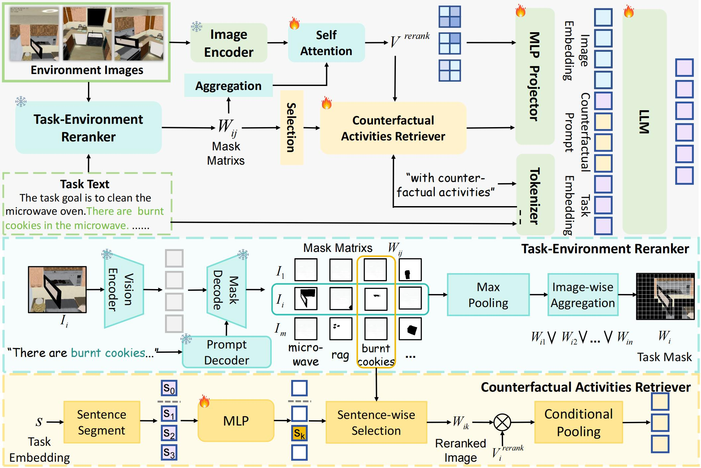

# LLaPa: A Vision-Language Model Framework for Counterfactual-Aware Procedural Planning

LLaPa is a vision-language model (VLM) framework designed for multimodal procedural planning. It can generate executable action sequences based on textual task descriptions and visual environment images.

To enhance planning capabilities, LLaPa integrates two core auxiliary modules:

- **Task-Environment Re-arranger (TER)**: Utilizes task-oriented segmentation to build a task-sensitive feature space, better aligning textual descriptions with the visual environment and highlighting regions critical for program execution.
- **Counterfactual Activity Retriever (CAR)**: Identifies and emphasizes potential counterfactual conditions, enhancing the model's reasoning ability in counterfactual scenarios.

---

## Framework Overview

The following figure shows the overall architecture of the LLaPa framework:



---


## Quick Start

### 1. Environment Setup

Our codebase depends on InternVL2 and Grounded-Anything. Please follow these steps to set up the environment.

First, clone this repository and the required Grounded-SAM-2 repository:

```bash
git clone https://github.com/sunshibo1234/LLaPa.git
cd LLaPa
git clone https://github.com/IDEA-Research/Grounded-Segment-Anything.git Grounded-SAM-2
```

Then, create and activate a conda environment:

```bash
conda create -n llapa python=3.10 -y
conda activate llapa
```

Next, follow the official instructions of InternVL2 and Grounded-Anything to install all required dependencies. Make sure PyTorch is properly configured in your environment.

### 2. Download Weights

Before running inference, you need to download the LLaPa model and Grounded-SAM pretrained weights. You do not need to download InternVL2-8B weights separately, as they are included in the LLaPa model.

- **LLaPa model weights**: Download from Hugging Face and place them in the `./pretrained` directory.
- **Grounded-SAM weights**:
  - Download `groundingdino_swint_ogc.pth` and place it in `./Grounded-SAM-2/gdino_checkpoints/`.
  - Download `sam2.1_hiera_large.pt` and place it in `./Grounded-SAM-2/checkpoints/`.

After downloading and placing all weights, your project directory should look like this:

```
LLaPa/
├── pretrained/
│   ├── config.json
│   ├── modeling_intern_vit.py
│   ├── ... (other model files)
│   └── pytorch_model.bin
├── Grounded-SAM-2/
│   ├── checkpoints/
│   │   └── sam2.1_hiera_large.pt
│   ├── gdino_checkpoints/
│   │   └── groundingdino_swint_ogc.pth
│   └── ... (other Grounded-SAM-2 files)
├── sample/
│   └── ...
├── Inference.py
└── ... (other project files)
```

### 3. Inference Demo

We provide a ready-to-use inference script `inference.py`. After configuring the environment and weights, simply run:

```bash
python inference.py
```

This script will load the model, process the example images in the `sample/` folder along with built-in textual instructions, and print the generated action plan sequence.

---

## Acknowledgements

This project draws heavily from the following excellent open-source projects. We sincerely thank their authors and contributors:

- [InternVL](https://github.com/OpenGVLab/InternVL): Provided a powerful and efficient vision-language model foundation.
- [Grounded-Segment-Anything](https://github.com/IDEA-Research/Grounded-Segment-Anything): Provided key segmentation capabilities for our Task-Environment Re-arranger (TER) module.
